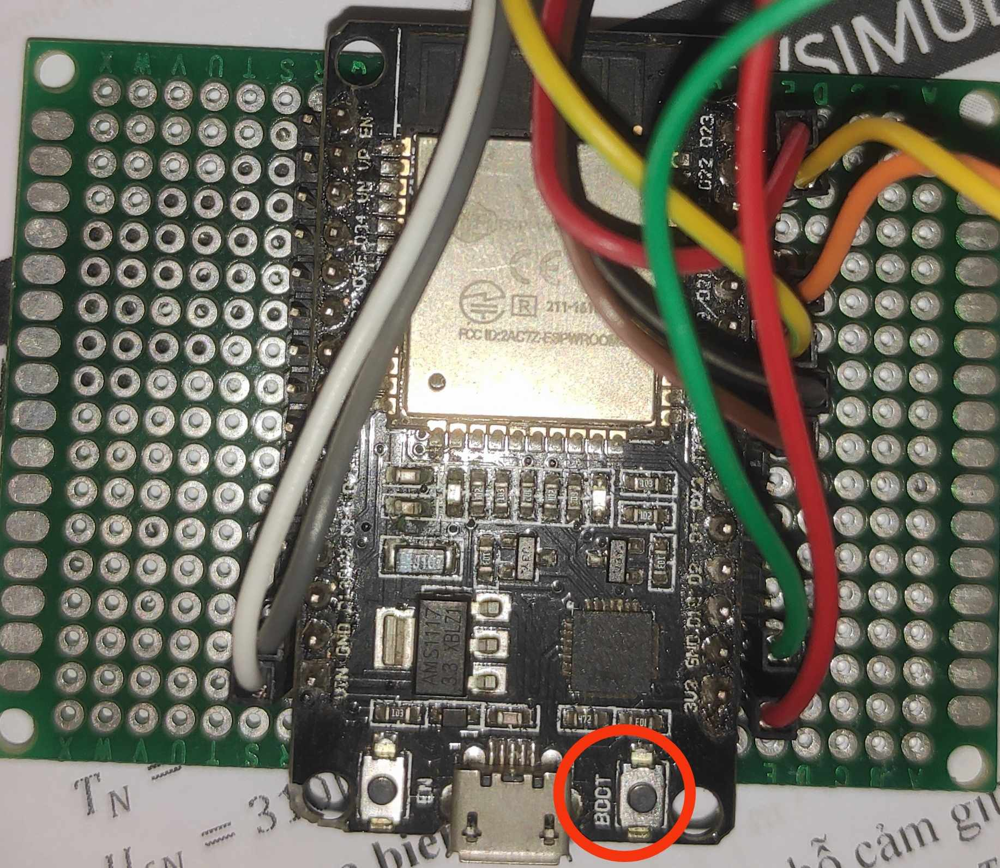

# Like_sensor_sys
- ESP32 as main microController
- Light Sensor (BH1750FVI) using I2C protocol
- Using ESP Rainmaker to control devices
# Hướng dẫn sử dụng
## Về phần cứng: Khi sử dụng lần đầu hoặc muốn đổi wifi của thiết bị, nhấn và giữ nút boot trong 5s

